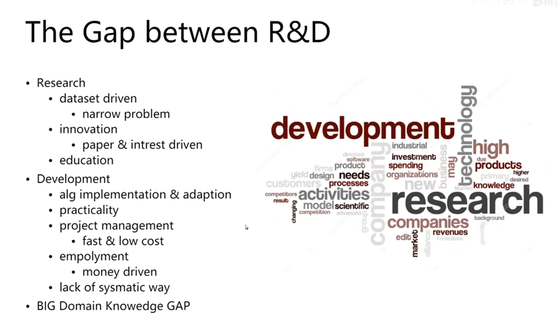
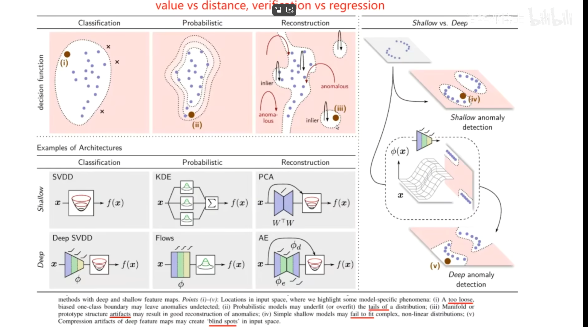
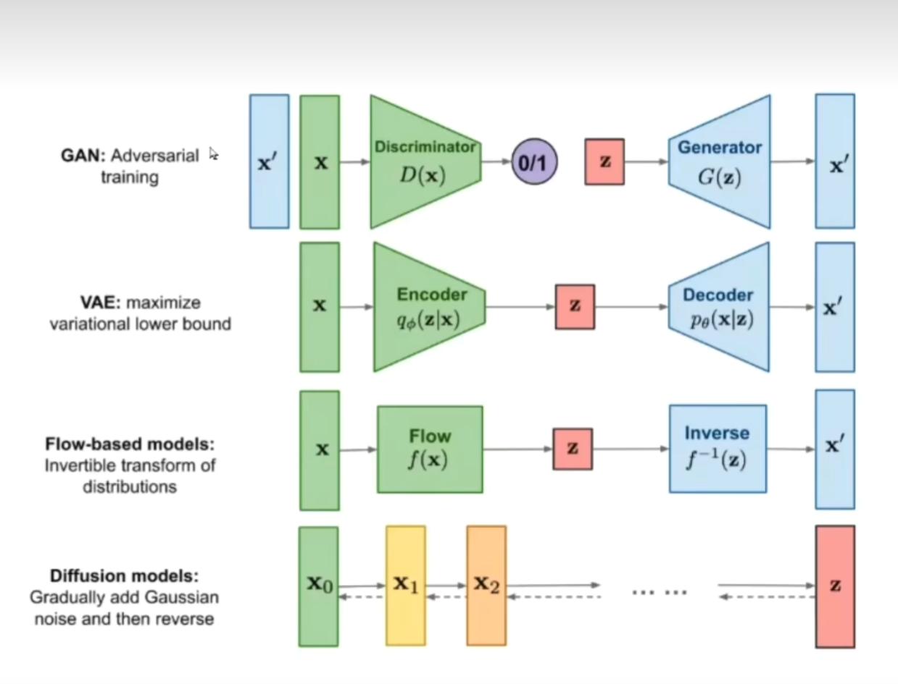

## 朱老师 各位老师 各位专家大家上午好

我是22级软件工程硕士研究生李鹏程。我毕设的题目是基于改进 YOLOv5 的光伏组件EL 图像缺陷检测方法研究。

我的答辩主要有一下几个部分。
缺陷检测现状
解决方案
近期工作
下一步计划
谢谢

## 缺陷检测现状

EL图像简介

**缺陷分类**

1. 形状
   1. tiny
   2. thin
   3. irregular
   4. scar
   5. distortion
2. 纹理
   1. dim
   2. low contrast
   3. blur
   4. scatter overlay

**缺陷检测难点**

1. background disturbance: 
2. inconsistent/ambiguity of meaning: 行业命名 和 视觉看到的图像上的区别 是不一致的
3. usually governed by nature not human even under controlled environment: 生产是在可控环境内，但瑕疵的产生是由于自然界或者说不可控的因素。

**行业痛点**

1. 样本不均衡。
   瑕疵样本容量相对于正常样本往往小很多，况且由于前面提到的瑕疵种类繁多，进一步加剧了这种不均衡，很难实现样本覆盖度的全面
2. 实时性。需要在产品线的流程中快速发现定位瑕疵
3. 特征理解、调参、可解释性

**Difficulties	**
Hard：
small area 小面積  
dim 暗淡
thin line  細線
scatter 分散
另一个角度，小的细微的瑕疵真的很看重吗？如果生产要求不高的话，可以放过，否则会出现良品率低产出少的情况。这也是一个需要平衡的方面

## 解决方案

无监督， 标注相对少，难以覆盖全面

（reconstruction 通过瑕疵样本-->重构出无瑕疵的样子。做对比）
为了解决缺陷检测领域样本量不足的问题。本人初步设想的方案是 
生成缺陷样本以扩大样本的数量。之后将生成的样本用于缺陷检测模型的训练。

#### Recontruction样本生成选型

本质目的 是将复杂分布变为可以掌控的分布，以判断有无瑕疵

##### GAN

##### VAE

##### Flow-Based models

##### Diffusion models

## 近期的工作汇报

近期着重解决第一个问题，也就是样本生成问题。

如之前的介绍，一方面缺陷可能会很细微；自然语言对不同缺陷类别的定义

通常reconstruction base

When generating different default surface images for anomaly detection, each of the mentioned models has its strengths and weaknesses. The best choice depends on the specific requirements and characteristics of your task. Here’s a brief overview of each method:

1. **Conditional Generative Adversarial Networks (cGANs)**:
   - **Pros**:
     - Can generate high-quality images.
     - Flexible and can be conditioned on various inputs to control the type of generated images.
   - **Cons**:
     - Training can be unstable and requires careful tuning.
     - Might struggle with generating diverse samples unless well-conditioned.

2. **Variational Autoencoders (VAEs)**:
   - **Pros**:
     - Provides a probabilistic framework for image generation.
     - Ensures that generated images are diverse due to the use of a latent space.
     - Training is typically more stable than GANs.
   - **Cons**:
     - Generated images might be blurrier compared to GANs.
     - Balancing the reconstruction loss and the KL divergence term can be challenging.

3. **Flow-based Models**:
   - **Pros**:
     - Exact likelihood estimation.
     - Can generate high-quality images.
     - Invertible architecture allows for easy sampling and reconstruction.
   - **Cons**:
     - Computationally expensive, especially for high-resolution images.
     - Requires a large number of parameters.

4. **Diffusion Models**:
   - **Pros**:
     - Capable of generating high-quality and highly diverse images.
     - Generally more stable training compared to GANs.
     - Recent advancements show promising results in image quality and diversity.
   - **Cons**:
     - Computationally intensive due to iterative denoising steps.
     - Slower inference time compared to other models.

### Recommendation:

**Diffusion Models** are currently a strong choice for generating different default surface images for anomaly detection due to their ability to produce high-quality and diverse images. Recent advancements have made them particularly effective for various image generation tasks, including anomaly detection. While they can be computationally intensive, their stability and quality of results often justify the additional computational cost.

**cGANs** could be another good option if you have specific conditions or attributes you want to control in your generated images. However, be prepared to spend more time on tuning and stabilizing the training process.

**VAEs** are a viable option if you prioritize a probabilistic framework and can tolerate slightly lower image quality. They are also easier to train and generally more stable.

**Flow-based Models** might be less practical for this use case due to their computational demands and complexity.

Overall, **Diffusion Models** stand out as a well-rounded choice for generating diverse and high-quality surface images for anomaly detection.